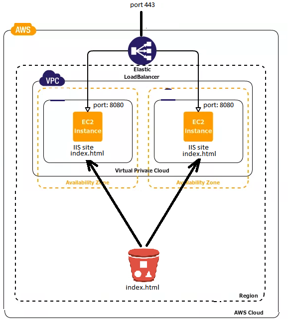

This LoadBalancer listen 80 port, not 443 (I don't have DNS name to register SSL cert on it)
-------------------------------

To deploy this environment with test application:

- Clone this git
- ```cd``` to ```terraform``` folder
- create file ```terraform.tfvars``` with content
```
access_key = "YOUR_AWS_ACCESS_KEY"
secret_key = "YOUR_AWS_SECRET_KEY"
```
- ```terraform init```
- ```terraform apply```
- after applying you will receive output with dns name of LoadBalancer. Copy it and enter in your browser.

-------------------------------------------
Your AWS user should have IAM access to:
```
AmazonS3FullAccess
IAMFullAccess
AmazonEC2FullAccess
```